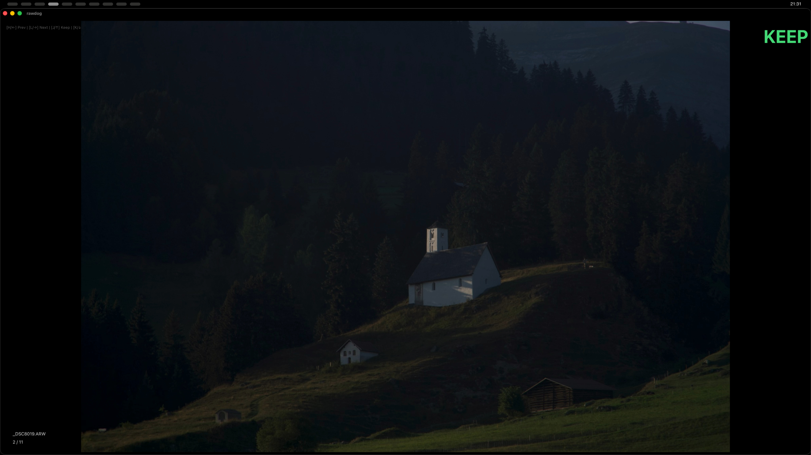
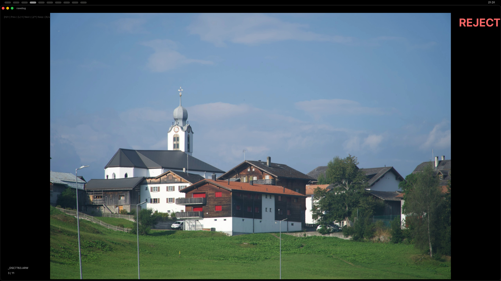

# rawdog

**The Fastest Photo Culling Tool for macOS.**

`rawdog` is a high-performance, terminal-first photo culling application designed for photographers who need to triage large sets of RAW images with zero latency.

<p align="center">
  
</p>

## Why rawdog?

Traditional photo editors are heavy and slow. `rawdog` is built for one thing: **speed**. It leverages native macOS hardware acceleration and a streamlined keyboard workflow to help you find your keepers in minutes, not hours.

- **Extreme Performance:** Uses macOS `sips` for native, hardware-accelerated preview extraction.
- **Zero Latency:** Intelligent image pre-loading ensures the next photo is ready before you even press the key.
- **Minimalist UI:** Focused entirely on the image with a distraction-free black background.
- **Keyboard-First:** Optimized for rapid triage using high-speed "swipe-style" controls.

## Features

- **RAW Support:** Native support for `.ARW`, `.CR2`, `.NEF`, `.DNG`, `.ORF`, and `.RAF`.
- **Custom Protocol:** Uses a proprietary `rawdog://` protocol to bypass standard browser sandboxing for instant local file access.
- **Smart Move:** Automatically moves unkept images to an `unused/` folder when you finish, keeping your workspace clean.
- **CLI & GUI:** Launch from your terminal with a path, or use the native folder selector.

## Screenshots

|         Keep (J / ↑)         |          Reject (K / ↓)          |
| :--------------------------: | :------------------------------: |
|  |  |

## Installation

Ensure you have [Rust](https://rustup.rs/) and [Node.js](https://nodejs.org/) installed.

```bash
# Clone the repository
git clone https://github.com/k1tesurfen/rawdog.git
cd rawdog

# Install dependencies
npm install

# Build the production app
npm run tauri build
```

The application bundle will be available in `src-tauri/target/release/bundle/macos/rawdog.app`.
Typically the post build script will offer the installation of rawdog like a typical macOS app.

## Usage

### Terminal (Recommended)

```bash
# Move to Applications
cp -r src-tauri/target/release/bundle/macos/rawdog.app /Applications/

# Add alias to ~/.zshrc
alias rawdog='/Applications/rawdog.app/Contents/MacOS/rawdog'

# Run it
rawdog ~/Photos/MyAwesomeShoot
```

### GUI

Simply double-click `rawdog.app` and use the built-in folder selector to begin.

## Controls

| Key       | Action                                     |
| :-------- | :----------------------------------------- |
| `H` / `←` | **Previous** Image                         |
| `L` / `→` | **Next** Image                             |
| `J` / `↑` | **Keep**                                   |
| `K` / `↓` | **Reject**                                 |
| `F`       | **Favorite**                               |
| `U`       | **Undo** (Reset status and go back)        |
| `ESC`     | **Finish** (Triggers confirm/exit flow)    |
| `ENTER`   | **Confirm Finish** (Moves files and exits) |

## Development

Built with **Tauri v2**, **Rust**, and **Vanilla TypeScript**.

- Backend: Rust + `sips` + `tauri-plugin-dialog`
- Frontend: Vite + TypeScript

## Next Steps

- UI polishing
- Settings for "rejected"-folder naming and keyboard shortcuts
